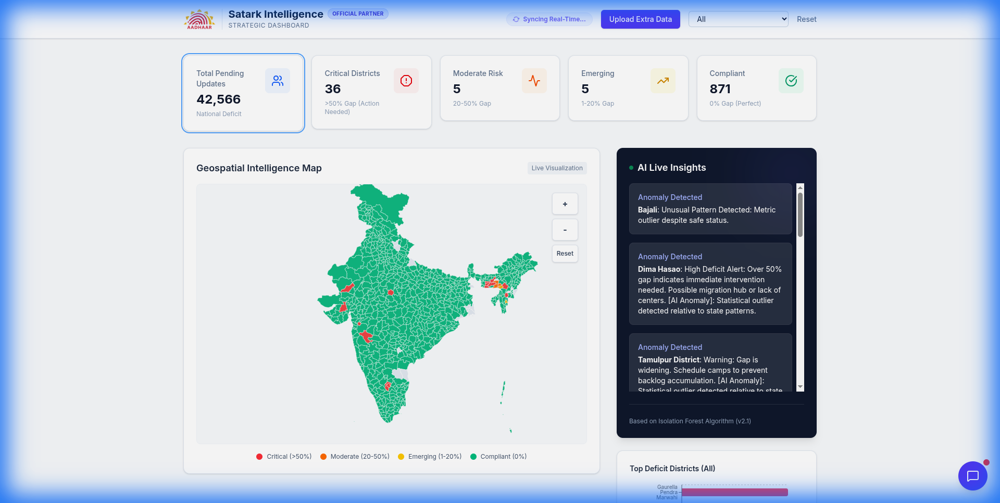
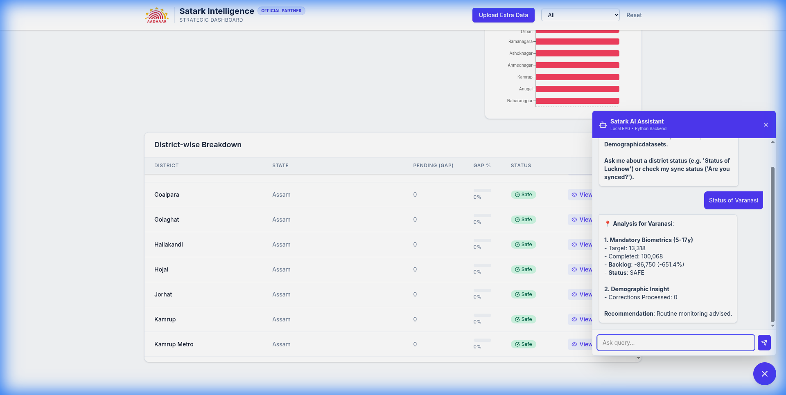
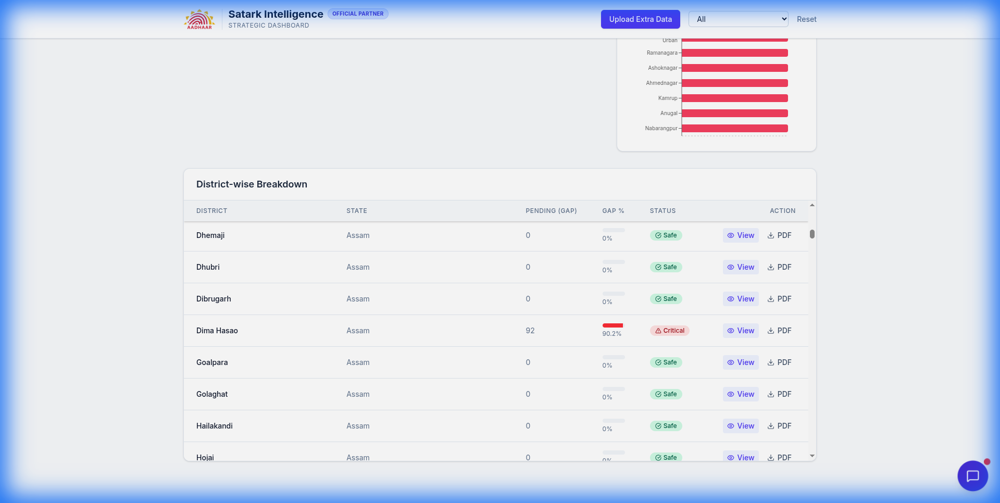
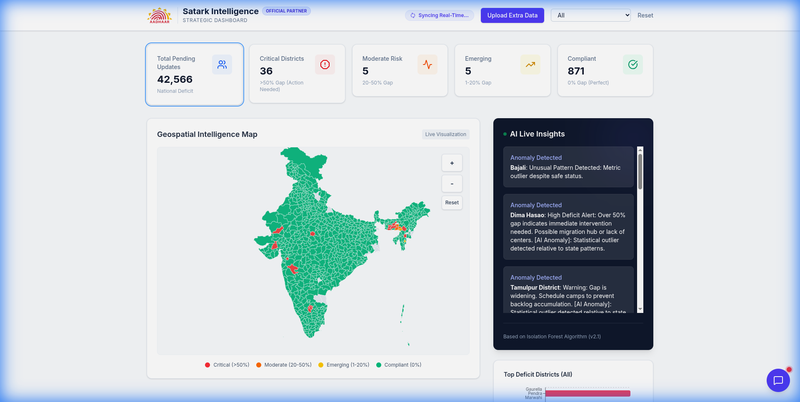

# Aadhaar Satark: Strategic Dashboard & Analytics 🇮🇳

> **Team**: HackElite_Coders  
> **Theme**: Data Analytics & AI  
> **Award-Winning Solution for Intelligent Governance**



## 🌟 Executive Summary
**Aadhaar Satark** (Vigilant Aadhaar) is a Unified Command Center designed for **UIDAI Nodal Officers**. It transforms static Enrolment & Update datasets into **Geospatial Intelligence** and **Predictive Insights**.

Our system addresses the "Last Mile" problem in update saturation by identifying micro-gaps at the district level and providing AI-driven policy guidance.

## 🚀 Key Features

### 1. 🔍 Intelligent Search & AI Guidance
Why manually filter tables? Just ask our **Satark AI Agent**.
- *Query*: "Show me stats for Varanasi"
- *Insight*: The AI analyzes real-time data and cross-references it with UIDAI guidelines.


### 2. 🚨 Critical Gap Identification
We auto-flag districts falling below the national average.
- **Red Zone**: >30% Update Gap
- **Action Plan**: Automated resource allocation suggestions (Mobile Units vs Permanent Centers).


### 3. 🗺️ Geospatial Exploration
Interactive heatmaps allow officers to visualize density and coverage instantly.
- **Hover Insights**: Immediate access to key KPIs (Penetration %, Update Lag).


### 4. 📄 Automated Strategic Reports
Generate official PDF reports for district meetings with one click.
- **Content**: AI Executive Summary, Anomaly Detection Graphs, and signatures.


## 🛠️ Technology Stack
| Layer | Tech | Utility |
| :--- | :--- | :--- |
| **Frontend** | Next.js 14, React | Fast, Interactive Dashboard |
| **Vis** | Recharts, D3.js | Data Storytelling |
| **Backend** | FastAPI (Python) | High-performance API |
| **Logic** | Pandas, Scikit-learn | Anomaly Detection Model |
| **AI/LLM** | RAG (LangChain) | Context-aware Policy Assistant |
| **Deploy** | Render (Docker) | Scalable Cloud Infrastructure |

## 🚀 Getting Started

### Live Deployment
[**Click Here to Open App**](https://aadhaar-satark.onrender.com)

### Local Development
```bash
# Clone the repo
git clone https://github.com/saurabhhhcodes/aadhaar-satark.git

# Run with Docker (Recommended)
docker build -t aadhaar-satark .
docker run -p 8000:8000 aadhaar-satark
```

## 📜 License
MIT License. Built for UIDAI Hackathon 2026.
