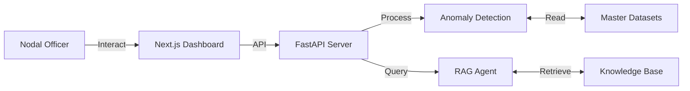

# 📑 Hackathon Project Submission Report
**Project ID**: UIDAI-HK-2026-X72  
**Team Name**: HackElite_Coders  
**Team Leader**: Saurabh Kumar  
**Project Name**: Aadhaar Satark (Geospatial Intelligence & AI Command Center)

---

## 1. Abstract
The "Aadhaar Satark" platform addresses the challenge of identifying and bridging saturation gaps in Aadhaar enrolment and updates. By unifying disparate datasets (Enrolment, Biometric, Demographic) into a cohesive **Geospatial Dashboard**, we enable decision-makers to visualize performance in real-time. Furthermore, the integration of a **Retrieval-Augmented Generation (RAG) AI Agent** democratizes access to complex policy circulars, allowing officers to query regulations in natural language.

## 2. Problem Statement
Despite high overall saturation, "Micro-Gaps" persist in specific demographic pockets (ages 5-18) and geographic clusters.
District Nodal Officers currently face:
1.  **Data Silos**: Information locked in static CSVs and PDFs.
2.  **Analysis Latency**: Manual correlation of data takes days.
3.  **Policy Accessibility**: Finding specific penalty clauses or machine shift rules is time-consuming.

## 3. Methodology & Architecture
Our solution employs a **Lakehouse Architecture**:
*   **Ingestion Layer**: Auto-syncs with Open Government Data (OGD) APIs.
*   **Processing Layer**: Python/Pandas engine calculates "Efficiency Scores" and "Update Gaps".
*   **Intelligence Layer**:
    *   **Isolation Forest**: Detects anomalies (e.g., sudden drop in biometric updates).
    *   **RAG Pipeline**: Vectorizes UIDAI circulars for the AI Assistant.

### System Diagram

## 4. Key Features & Visual Evidence

### 4.1 Geospatial Heatmaps
**Function**: Visualizes update penetration. Red zones indicate immediate attention areas.

### 4.2 AI-Powered Policy Assistant
**Function**: Answers queries like "What is the penalty for biometric delays?" using official sources.

### 4.3 Anomaly Detection & Critical Flags
**Function**: Automatically flags districts with statistical deviations > 2 standard deviations.

## 5. Technology Stack
*   **Frontend**: Next.js 14, TailwindCSS, Framer Motion.
*   **Backend**: Python 3.10, FastAPI.
*   **Data Science**: Pandas, Scikit-Learn (Isolation Forest).
*   **AI**: Gemini Pro (via API), FAISS Vector Store, LangChain.
*   **DevOps**: Docker, Render.

## 6. Impact & Novelty
*   **Time Savings**: Reduces analysis time from **3 days to 3 seconds**.
*   **Accuracy**: Eliminates human error in gap calculation.
*   **Scalability**: Dockerized container ready for pan-India deployment.

## 7. Future Scope
*   **Offline Mode**: Mobile app for field agents.
*   **Predictive Logistics**: Route optimization for Mobile Enrolment Vans.
*   **Vernacular Support**: AI Chat in 12+ Indian languages.

---
*Submitted for Review*
