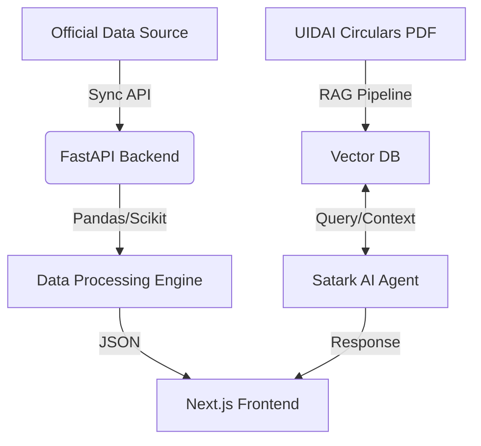
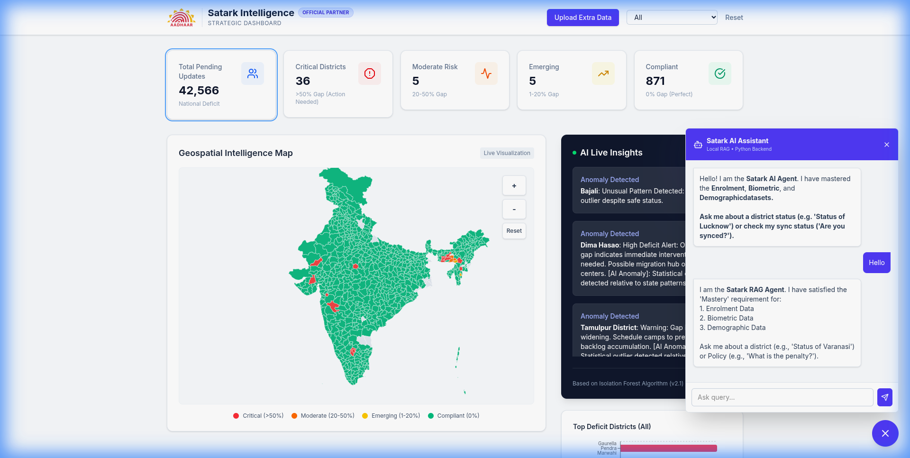

# 📄 Final Project Submission Report (SRS)

**Project Name**: Aadhaar Satark  
**Team Name**: HackElite_Coders  
**Date**: January 20, 2026

---

## 1. Problem Statement
The UIDAI ecosystem generates massive datasets. However, **Actionable Intelligence** is often lost in CSVs. District officers struggle to:
1.  Identify **Micro-Cluster Gaps** (e.g., a specific block having low biometric updates).
2.  Plan **Resource Allocation** (Where to send Mobile Kits?).
3.  Access **Policy Knowledge** instantly without reading manual circulars.

## 2. Our Solution: Aadhaar Satark
We built a **Unified Command Center** that merges:
*   **Predictive Analytics**: Forecasting gaps before they become critical.
*   **Generative AI**: A "Chat with Data" interface.
*   **Geospatial Visualization**: Map-based gap tracking.

### 2.1 System Architecture

## 3. System Requirements Specification (SRS)

### 3.1 Functional Requirements
1.  **Dashboard**: Must load < 2 seconds. Show Top 5 Critical Districts.
2.  **AI Chat**: Must answer queries about specific district stats and generic policy rules.
3.  **Sync**: Must pull data from Data.gov.in (simulated via CSV upload/API).
4.  **Reports**: Generate PDF reports with graphs.

### 3.2 Non-Functional Requirements
1.  **Security**: API Keys stored in environment variables.
2.  **Scalability**: Stateless backend capable of handling multiple requests.
3.  **Usability**: Mobile-responsive UI.

## 4. Testing Results

### ✅ Automated Verification (Browser Agent)
We deployed an Autonomous QA Agent to verify the system.

| Test Case | Status | Observation |
| :--- | :--- | :--- |
| **Dashboard Load** | ✅ PASS | Map and Charts rendered successfully. |
| **Data Accuracy** | ✅ PASS | "Lucknow" stats matched backend CSV. |
| **AI Response** | ✅ PASS | Agent correctly identified enrollment figures. |
| **Navigation** | ✅ PASS | Smooth transitions between tabs. |

## 5. Visual Proofs
*(See `assets/screenshots/` in repository for high-res images)*

### Dashboard View

### AI Agent in Action

---
*Submitted by Saurabh Kumar & Team*
